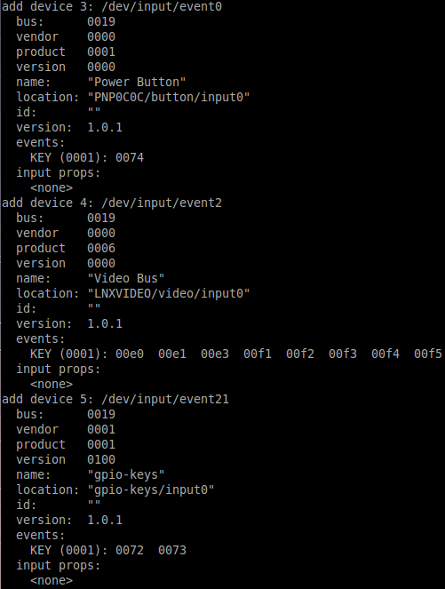

# adb-event-record
adb-event-record is a tool to record sensor's events like touch event and so on using the ADB (Android Debug Bridge).

During Android development you often want to record or reproduce some issues or testing steps. 

This script solves that problem by recording device's events like touch event, input event, and etc. Thus, you can use this script to play the recorded events back to do the repeated steps atuomatically. 

### Setup
 
* You need to enable USB debugging mode.
* Make sure your `adb` can work
* Clone this project or download the python files
```
git clone https://github.com/tzutalin/adb-event-record.git

or 

wget https://raw.githubusercontent.com/tzutalin/adb-event-record/master/adbrecord.py; chmod +x adbrecord.py
```

### Usage
* Show all functions

```
./adbrecord.py --help

usage: adbrecord.py [-h] [-e COMMAND] [--device] [--repeat] [--show]
                    [-n EVENT] [-r RECORD] [-p PLAY] [--activity ACTIVITY]

Record events from an Android device

optional arguments:
  -h, --help            show this help message and exit
  -e COMMAND, --adb COMMAND
                        Use the given adb binary and arguments.
  --device              Directs command to the only connected USB device;
                        returns an error if more than one USB device is
                        present. Corresponds to the "-d" option of adb.
  --repeat              Repeat to play the events.
  --show                Show all of the events from the device
  -n EVENT, --event EVENT
                        The event number, n, to record /dev/input/event[n]
  -r RECORD, --record RECORD
                        Store the record data to the file
  -p PLAY, --play PLAY  Play the record data
  --activity ACTIVITY   Go the activity when play the record events
```

* Show all events on your device

```
./adbrecord.py --show
```



* Record

Store the event to record.log and record the /dev/input/event4 only
```
./adbrecord.py -r record.log -n 4

n=4 is my touch input event
```

Store all of the events to record.log
```
./adbrecord.py -r record.log
```

* Playback

Repeat to play the record events
```
./adbrecord.py -p record.log --repeat
```

Play the record events without repeating
```
./adbrecord.py -p record.log
```

Go to com.tzutalin.test.main Activity, and play the record events without repeating
```
./adbrecord.py -p record.log --activity com.tzutalin.test.main
```
